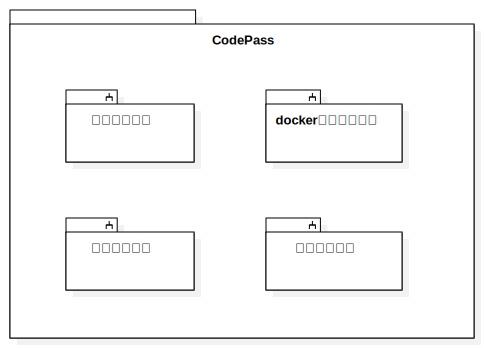
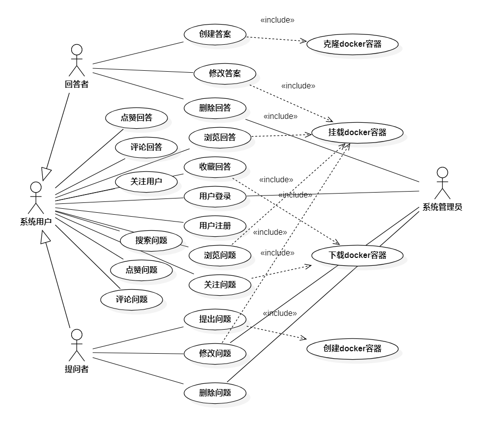
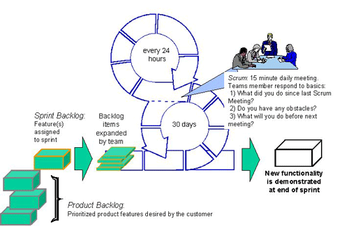

# CodePass!——基于Docker的云端代码问答社区

- 配环境配到头秃?

- 我照书上写的, 为啥也有错?

- StackOverflow? SegmentFault? CoreDump?...

- **CodePass!**

---

# 项目背景

- 现状 (痛点)

    - 提问者往往无法找到代码出错的关键部分，不能提供足够的信息

    - 环境不同，回答者难以复现提问者的问题

    - 提问者无法看到实时的执行结果，沟通效率低

- 目标

    - 基于`Docker`提供`code server`运行环境, 让回答者可以使用拥有完整功能的vscode网页版进行错误复现

    - 使用`Git`, `Diff`工具显示代码变化, 让提问者可以直观地看到问题出在哪里

    - 建立`回答奖励`机制, 鼓励小白一步步成长为大牛

---

# 系统架构 (模块划分)

CodePass系统整体上分为4个主要的功能模块

---

# 需求分析

- 参与者

    - 提问者

    - 回答者

    - 管理员

- 用例图

- 活动图 (事件流)

    - <!-- TODO -->

- 用例规约

    - <!-- TODO -->
---

# 软件过程模型

<!-- TODO: 用哪种软件过程模型 -->

我们使用Scrum模型进行整个系统的开发

我们每一周进行一次冲刺 (Sprint)以确定本周的开发方向, 然后通过每日站会的方式解决项目开发中遇到的问题. Sprint结束时, 会产出一个最小化, 可发布(运行)的产品, 然后进入下一轮的Sprint.

---

# 原型图 (UI/UX)

<!-- TODO -->

---

# Q&A

